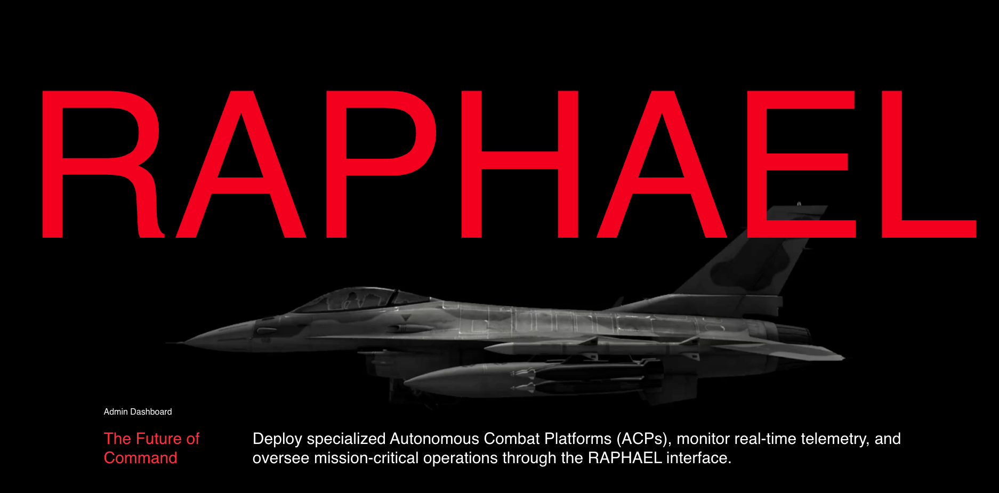
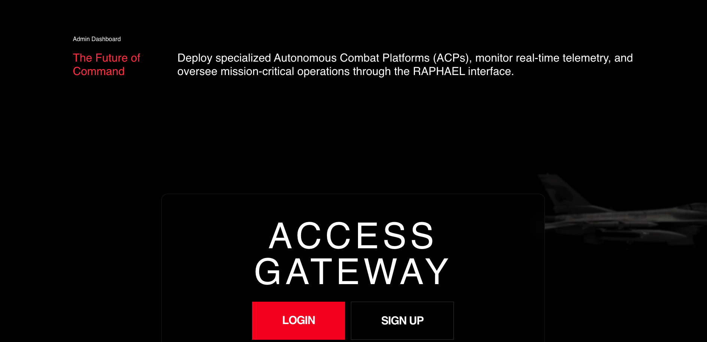
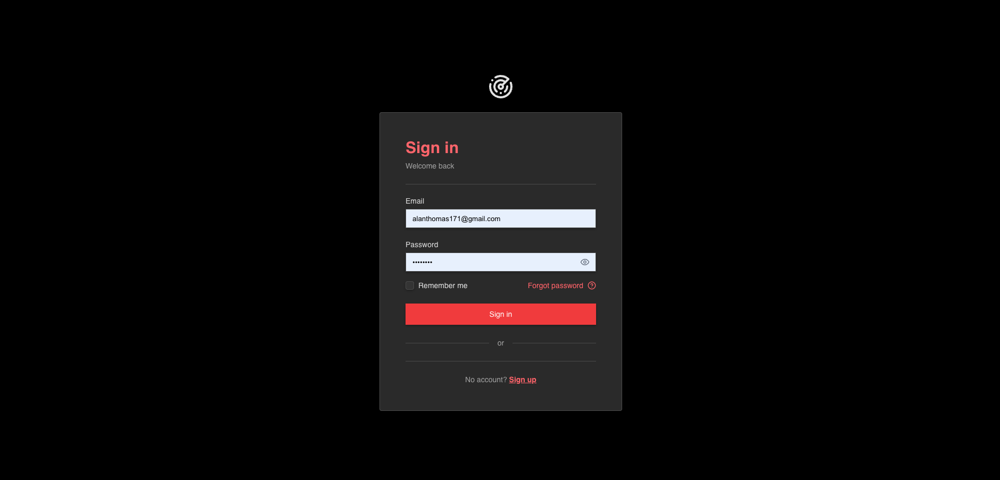
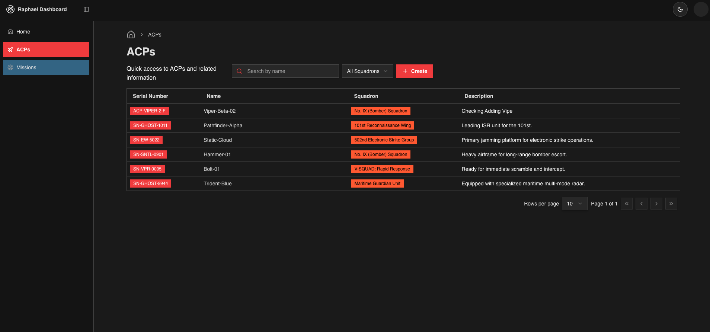
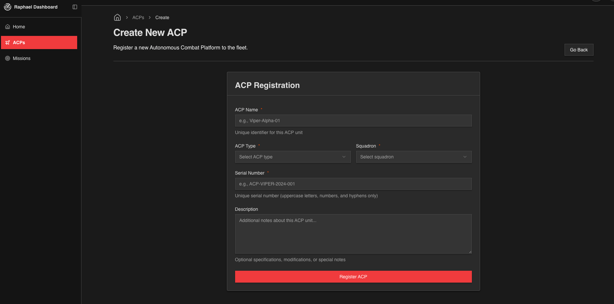

Leonardo Project Dashboard (Frontend)
A role-based operations dashboard for managing ACPs, squadrons, and missions with search, filtering, and pagination.

Backend Repo: https://github.com/alanthoms/raphael-backend

-Secure login + session handling (role-based access for Operator / Commander / Admin)
-View/manage ACP records (create, list, search, filter by squadron, paginate)
-View/manage missions (create, list, search, paginate)
-Guarded routes/components so UI only renders once identity/session is confirmed

-Refine (data + routing + auth integration)
-UI: shadcn/ui + tailwind + GSAP
-React Hook Form + Zod (form validation)
-Data provider talking to Express API

## Screenshots

### Dashboard Overview

### ACP Management

### Mission Management

### Role-Based Access

### Filtering & Search

